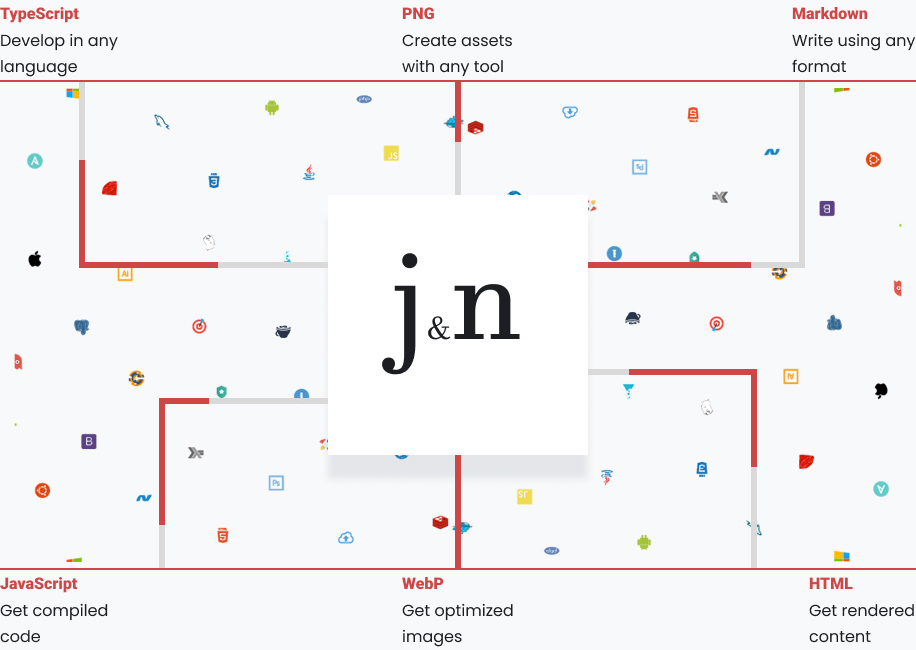

# bun-swc-gulp5



## To install dependencies:

```bash
bun install
```

## To run scripts:

#### Command to check all SCSS files for Stylelint compatibility
```bash
bunx stylelint
```

#### Command to check and fix all SCSS files for Stylelint compatibility
```bash
bunx stylelint-fix 
```

#### command to check all SCSS files for editorconfig compatibility
```bash
bunx code 
```

#### Base command to start Gulp
```bash
bun gulp dev 
```

#### Command to start Gulp in production mode 
```bash
bun gulp build
```

#### Use this command after bun build to upload new files to the host without caching them
```bash
bun gulp cache 
```

#### Command to build the project for the backend
```bash
bun gulp backend
```

#### Command to zip completed and optimized project
```bash
bun gulp zip
```


> This project was created using `bun init` in bun v1.1.14. [Bun](https://bun.sh) is a fast all-in-one JavaScript runtime. <br>
Gulp v5.0, Gulp cli v3.0 & Rust-based SWC Speedy Web Compiler

## Folder and File Structure

```
bun-swc-gulp5
├─ .browserslistrc
├─ .ecrc
├─ .editorconfig
├─ .gitignore
├─ .htmlhintrc
├─ .stylelintignore
├─ .stylelintrc.json
├─ .swcrc
├─ bun.lockb
├─ gulp
│  ├─ config
│  │  └─ paths.js
│  └─ tasks
│     ├─ assets.js
│     ├─ avif-images.js
│     ├─ cache-files.js
│     ├─ clean.js
│     ├─ html-include.js
│     ├─ html-minify.js
│     ├─ images.js
│     ├─ rewrite-files.js
│     ├─ scripts-backend.js
│     ├─ scripts.js
│     ├─ styles-backend.js
│     ├─ styles.js
│     ├─ svg-sprite.js
│     ├─ webp-images.js
│     └─ zip-files.js
├─ gulpfile.js
├─ jsconfig.json
├─ package.json
├─ README.md
└─ src
   ├─ assets
   │  ├─ favicon.ico
   │  ├─ fonts
   │  │  └─ FlowCircular-Regular.woff2
   │  ├─ images
   │  │  ├─ cover-dark.jpg
   │  │  ├─ cover-light.jpg
   │  │  ├─ logo-dark.svg
   │  │  ├─ logo-light.svg
   │  │  ├─ svg
   │  │  │  ├─ facebook.svg
   │  │  │  ├─ instagram.svg
   │  │  │  ├─ light.svg
   │  │  │  ├─ linkedin.svg
   │  │  │  ├─ signal.svg
   │  │  │  ├─ tiktok.svg
   │  │  │  └─ twitter-x.svg
   │  │  └─ team
   │  │     ├─ team-image-1.jpg
   │  │     ├─ team-image-2.jpg
   │  │     └─ team-image-3.jpg
   │  ├─ mail.php
   │  ├─ phpmailer
   │  │  ├─ Exception.php
   │  │  ├─ PHPMailer.php
   │  │  └─ SMTP.php
   │  └─ videos
   ├─ index.html
   ├─ javascript
   │  ├─ components
   │  │  ├─ burger.js
   │  │  ├─ section-observer.js
   │  │  ├─ tabs.js
   │  │  ├─ test-esm-swc.js
   │  │  └─ theme-switcher.js
   │  ├─ functions
   │  │  ├─ burger-button.js
   │  │  ├─ intersection-observer.js
   │  │  ├─ tabs.js
   │  │  └─ theme-toggle.js
   │  ├─ main.js
   │  └─ _components.js
   └─ scss
      ├─ abstract
      │  ├─ _breakpoints.scss
      │  ├─ _browser-queries.scss
      │  ├─ _burger-button.scss
      │  ├─ _checkbox.scss
      │  ├─ _choco-theme-switch.scss
      │  ├─ _colors.scss
      │  ├─ _dark-theme-switch.scss
      │  ├─ _dark-theme.scss
      │  ├─ _design-system.scss
      │  ├─ _dim-theme-switch.scss
      │  ├─ _display.scss
      │  ├─ _functions.scss
      │  ├─ _global-mixins.scss
      │  ├─ _grape-theme-switch.scss
      │  ├─ _index.scss
      │  ├─ _light-theme-switch.scss
      │  ├─ _light-theme.scss
      │  ├─ _mate-theme-switch.scss
      │  ├─ _media-queries.scss
      │  ├─ _motions.scss
      │  ├─ _obsidian-theme-switch.scss
      │  ├─ _radio-tabs.scss
      │  ├─ _sage-theme-switch.scss
      │  ├─ _sizes.scss
      │  ├─ _surface-shadows.scss
      │  ├─ _tabs.scss
      │  ├─ _theme.scss
      │  ├─ _tooltip.scss
      │  └─ _typography.scss
      ├─ base
      │  ├─ _base.scss
      │  ├─ _fonts.scss
      │  ├─ _index.scss
      │  └─ _reset.scss
      ├─ components
      │  ├─ _buttons.scss
      │  ├─ _index.scss
      │  ├─ _navigations.scss
      │  ├─ _profile-card.scss
      │  ├─ _skip-link.scss
      │  ├─ _social-media.scss
      │  ├─ _tabs.scss
      │  └─ _theme-switcher.scss
      ├─ main.scss
      ├─ pages
      │  └─ _index.scss
      ├─ utilities
      │  ├─ _border-radius.scss
      │  ├─ _box-shadow.scss
      │  ├─ _button-reset.scss
      │  ├─ _centered-horizontal.scss
      │  ├─ _centered-vertical.scss
      │  ├─ _color.scss
      │  ├─ _container.scss
      │  ├─ _disable-scroll-on-ios.scss
      │  ├─ _disable-scroll.scss
      │  ├─ _display.scss
      │  ├─ _flow.scss
      │  ├─ _font-family.scss
      │  ├─ _font-size.scss
      │  ├─ _font-weight.scss
      │  ├─ _index.scss
      │  ├─ _input-reset.scss
      │  ├─ _is-hidden.scss
      │  ├─ _letter-spacing.scss
      │  ├─ _line-height.scss
      │  ├─ _list-reset.scss
      │  ├─ _round.scss
      │  ├─ _swiper-wrapper.scss
      │  ├─ _uppercase.scss
      │  ├─ _visually-hidden.scss
      │  └─ _wrapper.scss
      └─ vendors
         └─ _index.scss

```

## Work with html

Thanks to the gulp-file-include plugin, you can split an HTML file into various templates, which should be stored in the partials folder. It’s convenient to divide an HTML page into sections.

> To insert HTML parts into the main file, use `@include('layout/filename.html')`

If you want to create a multi-page site, copy __index.html__, rename it as needed, and use it.

When using the bun build command, you will get minified HTML code in a single line for all HTML files.

## Work with Styles

The build uses the __sass__ preprocessor with __scss__ syntax.

The style file structure uses the 7-1 pattern, meaning everything is divided according to its functionality. The __main.scss__ file imports all separately written styles from different folders.

For abstract styles such as design tokens, custom colors, etc., the __abstracts__ folder is used.

For the basic styles of the site, the base folder is used, which contains the following files: __general__ where the basic styles are written, __reset__ where the basic style resets are written, __fonts__ where fonts in woff2 format are connected via @include.

For various UI components, the __components__ folder is used.

For various semantic sections, such as __header__, __main__, __aside__, __footer__, etc., the __layout__ folder is used.

For different pages of the site, the __pages__ folder is used.

For utility classes, the __utilities__ folder is used.

For third-party libraries and plugins, the __vendors__ folder is used.

To modularize different style files, new __@forward__ rules are used, which need to be written for each SCSS file in the corresponding folder in the ___index.scss__ file. For example, the styles for buttons buttons.scss in the components folder need to be made modular by writing the __@forward__ directive in components/_index.scss as follows: __@forward__ 'buttons';, and then include it in the main __main.scss__ with __@use__ 'components';.

## Work with JavaScript

The build uses __SWC__ to compile JavaScript files, and __Webpack__ to bundle all JavaScript files into one.

## Work with Fonts

Build works only with __woff2__ format fonts.

Upload __.woff2__ files to the __assets/fonts__ folder. Then, call the __@font-face__ mixin in the _fonts.scss file.

Important! Don't forget add font  to include these fonts in the `<link preload>` tag in your HTML.

## Work with Images

Build supports __JPG/JPEG__, __PNG__, __SVG__, __WEBP__, and __AVIF__ image formats.

Place any images, except for the favicon, in the __src/assets/images__ folder.

If you need to create an SVG sprite, place the SVG files required for the sprite in the __src/assets/images/svg__ folder. Attributes such as fill, stroke, and style will be automatically removed. Other SVG files should be left in the __src/assets/images__ folder."

## Work with Assets

Any project Assets that do not have a designated folder should be stored in the __src/assets__ folder. These can include video files, PHP files (such as a form submission file), favicons, and others.

## Local Snippets

For convenience and faster development, local snippets have been added (located in the .vscode/snippets folder), which work thanks to the plugin described above. All snippets start with the prefix g-. Currently, the snippets are only for HTML (quick creation of navigation, social media links, correct picture tag with webp and avif, etc.)

## Ready-to-use Modules

The Build includes ready-to-use, frequently-used modules for various tasks. The already added functionality is listed below.

__Attention!__ The _functions.js_ file only describes the inclusion of all necessary modules. It is recommended to use all of this in separate files. For example, if you need to create a modal window, create a _modal.js_ file in the components folder, include it in the components.js file, and then use the connection code in the _modal.js_ file.

## Ready-to-use Modules

You can add a working burger menu to your page by doing the following steps:

1. In HTML, call the snippet `g-burger`.
2. Add the attribute `data-menu` to your potential menu in HTML.
3. In __src/scss/components/buttons__, add class __.burger__ and then call the mixin `burger`.

```scss
.burger { @include burger }
```

4. Create file burger-menu or etc in __src/javascript/components/ and import Ready-to-use Module ` import { toggleBurgerMenu } from '../functions/burger-button.js'; `
5. call the function `toggleBurgerMenu();`

### Theme Switcher

You can add a working Theme switcher to your page by doing the following steps:

1. In HTML, call the snippet `g-theme-toggle`.
2. In the __scr/javascript/components create file theme-toggler or etc javascript file and import Ready-to-use Module `import { themeToggle } from '../functions/theme-toggle.js';`
3. call the function `themeToggle();`

### Accessible Tabs

You can add a working Accessible Tabs to your page by doing the following steps:

1. In HTML, call the snippet `g-tabs`.
2. In the __src/scss/components__ create __tabs.scss__ file then add __.tabs__ class and call the mixin `tabs`
3. In the __scr/javascript/components__ create __tabs__ or etc js file and import Ready-to-use Module ` import { tabs } from '../functions/tabs.js'; `
4. call the function `tabs();`